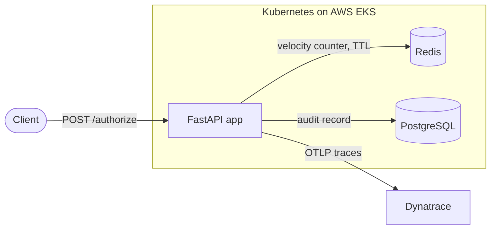

# Payment Authorization Platform

A real-time payment authorization service that decides approve/decline on each
transaction against fraud-style rules under a sub-150ms latency target, running
as a distributed service on Kubernetes with full CI/CD and observability.

Built from an empty directory to demonstrate an end-to-end SRE/DevOps workflow:
application code, infrastructure as code, automated delivery, and production-style
monitoring — each layer designed to be explained and defended, not just listed.

**Stack:** Python · FastAPI · PostgreSQL · Redis · Docker · AWS (EKS, ECR, VPC) ·
Terraform · Kubernetes · Jenkins · Ansible · OpenTelemetry · Dynatrace

> **Note on cloud resources:** the AWS infrastructure (EKS, VPC, NAT, ECR) is
> provisioned via Terraform and torn down after each working session to control
> cost. The repository contains everything needed to recreate it with a single
> `terraform apply`. 

---

## What it does

A client sends a transaction to `POST /authorize`. The service:

1. Increments a per-card counter in Redis (velocity tracking, time-windowed).
2. Checks the card against a blocklist.
3. Passes those facts to a pure decision engine that returns approve or decline.
4. Persists the decision to PostgreSQL as an audit record.
5. Emits a structured log line and an OpenTelemetry trace.



The three components — API, cache, and database — are separate tiers the API
talks to over the network, which is what makes this a distributed service rather
than a monolith.

---

## Design decisions worth explaining

These are the choices behind the code, written out because the reasoning matters
more than the lines themselves.

### The decision engine is pure

`app/decision_engine.py` has no database, no Redis, no network calls. It takes
facts that were already gathered and returns a verdict. All I/O lives at the edge
in `app/main.py`. The payoff: the rules are deterministic and unit-testable with
zero infrastructure — the test suite spins up nothing. Rules run in priority order,
first failing rule wins (blocklist, then amount, then velocity).

### Velocity uses a fixed-window Redis counter — and its limit is known

Each card gets a Redis key incremented per transaction, with a TTL set on the
first hit of a window. It is O(1) and fast. Its limitation is real and worth
stating: a burst straddling a window boundary can slip through (e.g. 5 at 0:59,
5 more at 1:01). The production fix is a sliding-window log or token bucket;
fixed-window is the right trade-off for this scope.

### A decline is not a failure

When the service declines a transaction, the API call still succeeds — it returns
`200 OK` with a decision. The decline is a *business* outcome, not a *technical*
one. This is why availability/failure-rate monitoring shows ~0% failures even
under heavy decline load: the service is working correctly. Decline rate is
tracked as a separate business metric.

---

## CI/CD pipeline (Jenkins)

A declarative `Jenkinsfile` runs on every push to `main`:

| Stage | What it does |
|-------|--------------|
| Test | Creates a venv, installs deps, runs `pytest`. Failure stops the pipeline. |
| Build & Push | Builds the image, tags it with the build number and `latest`, pushes to ECR. |
| Deploy | `kubectl set image` then waits on `rollout status` with a timeout. |
| Smoke test | Polls `/healthz` through the service until it answers. |
| Rollback | On any failure, `kubectl rollout undo` reverts to the last good revision. |

The auto-rollback was verified by deploying a deliberately broken image (readiness
probe forced to fail): the rollout never completed, the pipeline detected the
failure, and the deployment automatically reverted to the previous healthy
version with no manual intervention.

The Jenkins host itself is provisioned by an **idempotent Ansible playbook**
(`infra/ansible/`) that installs Docker, kubectl, AWS CLI, and Jenkins over SSH.
Re-running it on an already-configured host reports no changes.

---

## Observability (OpenTelemetry + Dynatrace)

The service is instrumented with OpenTelemetry, exporting traces over OTLP to
Dynatrace. The Distributed Tracing / Services view shows per-endpoint request
rate, response time, and the approve/decline split for `/authorize`.

SLOs are defined in [`observability/slo.md`](./observability/slo.md):

- **Latency:** 99% of `/authorize` requests under 150ms over 30 days.
- **Availability:** 99.9% non-5xx over 30 days.

The design for burn-rate alerting (multi-window: fast burn pages, slow burn
tickets) is documented alongside an incident runbook
([`observability/runbook-latency.md`](./observability/runbook-latency.md)) and a
load generator with a `--chaos` mode for driving traffic
([`observability/load.py`](./observability/load.py)).

---

## Running it locally

The whole stack runs with Docker Compose and zero configuration — the default
settings point at the compose service names.

```bash
docker compose up --build

# approve
curl -X POST localhost:8000/authorize -H 'content-type: application/json' \
  -d '{"card_token":"tok_abc","amount":100,"merchant_id":"m1"}'

# decline on amount
curl -X POST localhost:8000/authorize -H 'content-type: application/json' \
  -d '{"card_token":"tok_x","amount":99999,"merchant_id":"m1"}'

# run the tests (no infrastructure required)
python -m pytest tests/ -q
```

## Deploying to AWS

```bash
cd infra/terraform
terraform init && terraform apply          # VPC + EKS + ECR (~15 min)
$(terraform output -raw configure_kubectl)

# build and push the image to ECR, then:
kubectl apply -f k8s/data-tier.yaml
kubectl apply -f k8s/service-config-hpa.yaml
kubectl apply -f k8s/deployment.yaml
kubectl rollout status deployment/payment-auth
```

Tear down with `terraform destroy` to stop billing.

---

## Repository layout

```
payment-auth-platform/
  app/                 # FastAPI service
    config.py          # env-backed settings
    models.py          # Pydantic request/response
    decision_engine.py # pure rules, no I/O
    cache.py           # Redis velocity counter
    db.py              # Postgres persistence
    main.py            # wiring + health endpoints
    telemetry.py       # OpenTelemetry setup
  tests/               # decision engine unit tests
  infra/
    terraform/         # VPC, EKS, ECR as code
    ansible/           # idempotent Jenkins host provisioning
  k8s/                 # Deployment, Service, ConfigMap, HPA
  observability/       # SLOs, runbook, load generator
  Jenkinsfile          # CI/CD pipeline
  Dockerfile
  docker-compose.yml
```

---

## Things I would do differently

- **Migrations:** the demo creates tables on startup; production would use Alembic.
- **Secrets:** thresholds and tokens sit in a ConfigMap for speed they belong in
  Kubernetes Secrets or AWS Secrets Manager.
- **Velocity:** swap the fixed-window counter for a sliding window to close the
  boundary-burst gap.
- **CI host placement:** the Jenkins EC2 host should live in its own VPC (or be
  managed by Terraform) so teardown is a single command rather than a manual step.
- **IAM:** the CI host uses static AWS keys an EC2 instance role would remove the
  stored credentials entirely.
